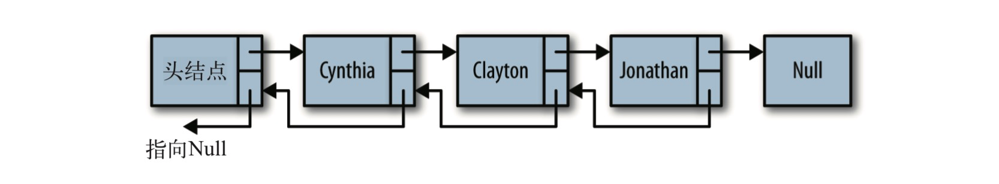

# 数据结构与算法

## 数组

### 什么是数组

一个存储元素的线性集合。JavaScript中的数组是一种特殊的对象，所以效率不如其他语言中的数组高

索引：数字索引在内部被转换为字符串类型，因为JavaScript中对象中的属性名必须是字符串

## 列表

### 什么是列表

列表是一组有序的数据。每个列表中的数据项称为元素。在 JavaScript 中，列表中的元素 可以是任意数据类型。列表中可以保存多少元素并没有事先限定，实际使用时元素的数量 受到程序内存的限制。

### 列表的实现

```text

function List() {
    this.listSize = 0;
    this.pos = 0;
    this.dataStore = []; // 初始化一个空数组来保存列表元素 
    this.clear = clear;
    this.find = find; 
    this.toString = toString; 
    this.insert = insert; 
    this.append = append; 
    this.remove = remove; 
    this.front = front;
    this.end = end;
    this.prev = prev;
    this.next = next;
    this.length = length;
    this.currPos = currPos;
    this.moveTo = moveTo;
    this.getElement = getElement;
    this.length = length;
    this.contains = contains;
}
function append(element) {
    this.dataStore[this.listSize++] = element;
}
function find(element) {
    for (var i = 0; i < this.dataStore.length; ++i) {
       if (this.dataStore[i] == element) {
          return i;
    } }
    return -1; 
}
function remove(element) {
    var foundAt = this.find(element); 
    if (foundAt > -1) {
       this.dataStore.splice(foundAt,1);
       --this.listSize;
       return true;
    }
    return false;
}
```

### 使用迭代器访问列表

使用迭代器可以不必关系数据的内部存储方式，以实现对列表的遍历。front\(\)、end\(\)、prev\(\)、next\(\)和currPos\(\)就实现了一个列表类的一个迭代器。

### 和使用数组索引的方式相比，使用迭代器的一些优点

* 访问列表元素时不必关心底层的数据结构
* 当为列表添加一个元素时，索引的值就不对了，此时只用更新列表而不用更新迭代器
* 可以使用不同类型的数据存储方式实现列表类，迭代器为访问列表里的元素提供了一种统一的方式 

## 栈

### 什么是栈

栈是一种高效的数据结构\(LIFO，后入先出\)，数据只能在栈顶添加或删除，然和不在栈顶的元素无法访问，为了得到栈底的元素必须拿掉上面的元素

### 对栈的操作

对栈的主要操作是将一个元素压入栈和将一个元素弹出栈，入栈使用push\(\)方法，出栈使用pop\(\)方法。peek\(\)方法只返回栈顶元素而不删除它。

### 栈的实现

```text
function Stack() {
   this.dataStore = [];
   this.top = 0;
   this.push = push;
   this.pop = pop;
   this.peek = peek;
   this.clear = clear;
   this.length = length;
}
function push(element) {
   this.dataStore[this.top++] = element;
}
function peek() {
   return this.dataStore[this.top-1];

}
function pop() {
   return this.dataStore[--this.top];
}
function clear() {
   this.top = 0;
}
function length() {
   return this.top;
}
```

### 使用栈的场景

#### 数制间的相互转换

```text
function mulBase(num, base) {
     var s = new Stack();
     while (num > 0){
        s.push(num % base);
        num = Math.floor(num /= base);
     };
     var converted = "";
     while (s.length() > 0) {
        converted += s.pop();
     }
     return converted;
  }
```

#### 回文

一个单词、短语或数字，从前往后写和从后往前写都是一样的。 比如，单词“dad”、“racecar”就是回文;

```text
    function isPalindrome(word) {
        var s = new Stack();
        for (var i = 0; i < word.length; ++i) {
           s.push(word[i]);
        }
        var rword = "";
        while (s.length() > 0) {
           rword += s.pop();
        }
        if (word == rword) {
           return true;
        } else {
           return false;
        }
      }
```

## 队列

队列是一种列表，只能在队尾插入元素，队首删除元素。队列用于存储按顺序排列的的数据，先进先出。

### 对队列的操作

队列的两种主要操作是:向队列中插入新元素和删除队列中的元素。插入操作也叫做入 队，删除操作也叫做出队。队列的另外一项重要操作是读取队头的元素。这个操作叫做 peek\(\)。该操作返回队头元 素，但不把它从队列中删除。除了读取队头元素，我们还想知道队列中存储了多少元素， 可以使用 length 属性满足该需求;要想清空队列中的所有元素，可以使用 clear\(\) 方法来 实现。

### 队列的实现

```text
 function Queue() {
  this.dataStore = [];
  this.enqueue = enqueue; // 向队尾添加一个元素
  this.dequeue = dequeue; // 方法删除队首的元素
  this.front = front; // 读取队首元素
  this.back = back; // 读取队尾元素
  this.toString = toString; // 
  this.empty = empty;
 } 
```

### 使用队列的场景

#### 方块舞的舞伴分配问题

#### 数据排序

#### 优先队列

## 链表

### 数组的缺点

* 在很多语言中，数组的长度是固定的
* 添加和删除需要将其他元素进行平移
* JavaScript中的数据是一种特殊的对象，相较于其他语言效率较低

### 什么是链表

链表是由一组节点组成的集合，每个节点都使用一个对象的引用指向它的后继，指向另一 个节点的引用叫做链。数组元素靠它们的位置进行引用，链表元素则是靠相互之间的关系进行引用

### 链表的实现

```text
function Node(element) {
  this.element = element;
  this.next = null;
}
function LList() {
  this.head = new Node("head"); 
  this.find = find;
  this.insert = insert; 
  this.display = display; 
  this.findPrevious = findPrevious; 
  this.remove = remove;
}
function find(item) {
  var currNode = this.head;
  while (currNode.element != item) {
     currNode = currNode.next;
  }
  return currNode;
}
function insert(newElement, item) { 
  var newNode = new Node(newElement); 
  var current = this.find(item); 
  newNode.next = current.next; 
  current.next = newNode;
}
function display() {
  var currNode = this.head;
  while (!(currNode.next == null)) {
     print(currNode.next.element);
     currNode = currNode.next;
  }
}
function findPrevious(item) {
  var currNode = this.head;
  while (!(currNode.next == null) && (currNode.next.element != item)) {
    currNode = currNode.next;
  }
  return currNode;
}
function remove(item) {
  var prevNode = this.findPrevious(item);
  if (!(prevNode.next == null)) {
      prevNode.next = prevNode.next.next;
  }

}
```

### 双向链表

尽管从链表的头节点遍历到尾节点很简单，但反过来，从后向前遍历则没那么简单。通过 给 Node 对象增加一个属性，该属性存储指向前驱节点的链接，这样就容易多了。此时向链表插入一个节点需要更多的工作，我们需要指出该节点正确的前驱和后继。但是在从链表 中删除节点时，效率提高了，不需要再查找待删除节点的前驱节点了。



```text
function Node(element) {
    this.element = element;
    this.next = null;
    this.previous = null;
}
function insert(newElement, item) { 
    var newNode = new Node(newElement);
    var current = this.find(item);
    newNode.next = current.next; 
    newNode.previous = current; 
    current.next = newNode;
}
function remove(item) {
    var currNode = this.find(item); 
    if (!(currNode.next == null)) {
       currNode.previous.next = currNode.next;
       currNode.next.previous = currNode.previous;
       currNode.next = null;
       currNode.previous = null;
    } 
}

function findLast() {
    var currNode = this.head;
    while (!(currNode.next == null)) {
       currNode = currNode.next;
    }
    return currNode;
}
function dispReverse() {
    var currNode = this.head;
    currNode = this.findLast();
    while (!(currNode.previous == null)) {
       print(currNode.element);
       currNode = currNode.previous;
    }
}
```


### 循环链表

如果你希望可以从后向前遍历链表，但是又不想付出额外代价来创建一个双向链表，那么就需要使用循环链表。从循环链表的尾节点向后移动，就等于从后向前遍历链表


## 字典

### 什么是字典

字典是一种以键 - 值对形式存储数据的数据结构，就像电话号码簿里的名字和电话号码一 样。要找一个电话时，先找名字，名字找到了，紧挨着它的电话号码也就找到了。JavaScript 的 Object 类就是以字典的形式设计的。

### 字典的实现

```text
function Dictionary() {
    this.add = add; 
    this.datastore = new Array(); 
    this.find = find;
    this.remove = remove;
    this.showAll = showAll;
}
function add(key, value) {
    this.datastore[key] = value;
}
function find(key) {
    return this.datastore[key];
}
function remove(key) {
    delete this.datastore[key];
}
function showAll() {
    for(var key in Object.keys(this.datastore)) {
       print(key + " -> " + this.datastore[key]);
    }
}
```

### 有序字典

```text
function showAll() {
  for(var key in Object.keys(this.datastore.sort())) {
     print(key + " -> " + this.datastore[key]);
  }
}
```

## 散列

### 什么是散列

散列是一种常用的数据存储技术，散列后的数据可以快速地插入或取用。散列使用的数据 结构叫做散列表。在散列表上插入、删除和取用数据都非常快，但是对于查找操作来说却 效率低下，比如查找一组数据中的最大值和最小值。这些操作得求助于其他数据结构，二 叉查找树就是一个很好的选择。

我们的散列表是基于数组进行设计的，使用散列表存储数据时，通过一个散列函数将键映射为一个数字，这个数字的范围是 0 到散列表的长度。

理想情况下，散列函数会将每个键值映射为一个唯一的数组索引。然而，键的数量是无限 的，数组的长度是有限的\(理论上，在 JavaScript 中是这样\)，一个更现实的目标是让散列 函数尽量将键均匀地映射到数组中。

### 对散列的操作

**计算散列值**的方法、向散列中**插入数据**的方法、 从散列表中**读取数据**的方法、显示散列表中数据分布的方法

### 散列的实现

```text
function HashTable() {
    this.table = new Array(137);
    this.simpleHash = simpleHash;
    this.betterHash = betterHash;
    this.showDistro = showDistro;
    this.put = put;
    //this.get = get;
}
function simpleHash(data) {
    var total = 0;
    for (var i = 0; i < data.length; ++i) {
       total += data.charCodeAt(i);
    }
    print("Hash value: " + data + " -> " + total);
    return total % this.table.length;
}
function betterHash(string, arr) {
    const H = 37;
    var total = 0;
    for (var i = 0; i < string.length; ++i) {
       total += H * total + string.charCodeAt(i);
    }
    total = total % arr.length;
    return parseInt(total);
}
function put(data) {
    var pos = this.betterHash(data);
    this.table[pos] = data;
}
function showDistro() {
    var n = 0;
    for (var i = 0; i < this.table.length; ++i) { 
    if (this.table[i] != undefined) {
          print(i + ": " + this.table[i]);
       }
    } 
}
       
```

### 碰撞处理

#### 开链法

开链法是指实现散列表的底层数组中，每个数组 元素又是一个新的数据结构，比如另一个数组，这样就能存储多个键了。使用这种技术， 即使两个键散列后的值相同，依然被保存在同样的位置，只不过它们在第二个数组中的位 置不一样。

#### 开链法的实现

```text
function buildChains() {
        for (var i = 0; i < this.table.length; ++i) {
           this.table[i] = new Array();
        }
}
function showDistro() {
   var n = 0;
   for (var i = 0; i < this.table.length; ++i) { 
      if (this.table[i][0] != undefined) {
         print(i + ": " + this.table[i]);
      }
   } 
}
// 新的 put() 方法则不同，它既保存数据，也保存键值。该方法使用链中两个连续的单元格，
第一个用来保存键值，第二个用来保存数据
function put(key, data) {
   var pos = this.betterHash(key);
   var index = 0;
   while (this.table[pos][index] !== undefined) { 
      ++index;
   }
   this.table[pos][index] = pos;
   this.table[pos][index+1] = data;
}
function get(key) {
  var index = 0;
  var pos = this.betterHash(key);
  if(this.table[pos] && this.table[pos].length >0){
    while(this.table[pos][index]!==key){
       ++index
    }
    return this.table[pos][index+1]
  }
  return undefined
}  
```

#### 线性探测法\(开放寻址法\)

第二种处理碰撞的方法是线性探测法。线性探测法隶属于一种更一般化的散列技术:开放 寻址散列。当发生碰撞时，线性探测法检查散列表中的下一个位置是否为空。如果为空， 就将数据存入该位置;如果不为空，则继续检查下一个位置，直到找到一个空的位置为 止。该技术是基于这样一个事实:每个散列表都会有很多空的单元格，可以使用它们来存 储数据。

**当存储数据使用的数组特别大时，选择线性探测法要比开链法好**。这里有一个公式，常常可以帮助我们选择使用哪种碰撞解决办法:如果**数组的大小是待存储数据个数的 1.5 倍**， 那么使用开链法;如果数组的大小是待存储数据的两倍及两倍以上时，那么使用线性探测法

```text
function put(key, data) {
    var pos = this.betterHash(key);
    if (this.table[pos] == undefined) {
        this.table[pos] = key;
        this.values[pos] = data;
    } else {
        while (this.table[pos] != undefined) {
            pos++; 
        }
        this.table[pos] = key;
        this.values[pos] = data;
    }
}
function get(key) {
    var hash = -1;
    hash = this.betterHash(key);
    if (hash > -1) {
        for (var i = hash; this.table[hash] != undefined; i++) { 
            if (this.table[hash] == key) {
             return this.values[hash];
            }
        } 
    }
    return undefined; 
}

```

## 集合

### 什么是集合

集合\(set\)是一种包含不同元素的数据结构。集合的两个最重 要特性是:首先，集合中的成员是无序的;其次，集合中不允许相同成员存在。

空集：不包含任何成员的集合

集合相等：两个集合的成员完全相同

子集：一个集合中所有的成员都属于另外一个集合

### 对集合的操作

并集：将两个集合中的成员进行合并，得到一个新集合

交集：两个集合中共同存在的成员组成一个新的集合

补集：属于一个集合而不属于另一个集合的成员组成的集合

### 集合的实现

```text
function Set() {
  this.dataStore = [];
  this.add = add;
  this.remove = remove;
  this.size = size;
  this.union = union;
  this.intersect = intersect;
  this.subset = subset;
  this.difference = difference;
  this.show = show;
}
function add(data) {
  if (this.dataStore.indexOf(data) < 0) {
     this.dataStore.push(data);
     return true;
  }
  else {
     return false;
} 
}
function remove(data) {
  var pos = this.dataStore.indexOf(data);
  if (pos > -1) {
     this.dataStore.splice(pos,1);
     return true;
  }
  else {
     return false;
} }

function contains(data) {
  if (this.dataStore.indexOf(data) > -1) {
     return true;
  }
  else {
     return false;
} }
function union(set) {
  var tempSet = new Set();
  for (var i = 0; i < this.dataStore.length; ++i) {
     tempSet.add(this.dataStore[i]);
  }
  for (var i = 0; i < set.dataStore.length; ++i) {
     if (!tempSet.contains(set.dataStore[i])) {
        tempSet.dataStore.push(set.dataStore[i]);
     }
   }
  return tempSet;
}
function difference(set) {
   var tempSet = new Set();
   for (var i = 0; i < this.dataStore.length; ++i) {
      if (!set.contains(this.dataStore[i])) {
        tempSet.add(this.dataStore[i]);
      } 
   }
   return tempSet;
}
```

## 二叉树与二叉查找树

### 什么是二叉树

树是计算机科学中经常用到的一种数据结构。树是一种非线性的数据结构，以分层的方式 存储数据。树被用来存储具有层级关系的数据，比如文件系统中的文件;树还被用来存储 有序列表。二叉树是一种特殊的树，它的子节点个数不超过两个，通过将子节点的个数限定为 2，可以写出高效的程序在树中插入、查找和删除数据。

### 什么是二叉查找树

二叉查找树是一种 特殊的二叉树，相对较小的值保存在左节点中，较大的值保存在右节点中

### 二叉查找树的实现

```text
function Node(data, left, right) {
    this.data = data;
    this.left = left;
    this.right = right;
    this.show = show;
}
function show() {
    return this.data;
}
function BST() {
    this.root = null;
    this.insert = insert;
    this.inOrder = inOrder;
}  
// 插入节点    
function insert(data) {
    var n = new Node(data, null, null);
    if (this.root == null) {
        this.root = n;
    } else {
    var current = this.root;
    var parent;
    while (true) {
        parent = current;
        if (data < current.data) {
            current = current.left;
            if (current == null) {
                parent.left = n;
                break; 
            }
        } else {
            current = current.right;
            if (current == null) {
                parent.right = n;
                break; 
            }
        } 
    }
}
// 遍历节点
```

### 二叉查找树的遍历

有三种遍历 BST 的方式:中序、先序和后序。中序遍历按照节点上的键值，以升序访问 BST 上的所有节点。先序遍历先访问根节点，然后以同样方式访问左子树和右子树。后序 遍历先访问叶子节点，从左子树到右子树，再到根节点。

```text

```

